# Volatility Forecasting and Regime Detection

As I have been preparing for quant finance, I've learnt that volatility is more useful than actual returns. Properties of volatility like clustering and persistence are some characteristics that can be identified in the data and used to make forecasts. 
The purpose of this project was to learn new concepts through their application. In this repo I use 20 years of SPY data and 4 forecasting models to test their robustness. It is structured as ten notebooks with comments that will walk you through my thought process. 

---

## Highlights

| # | Concept | Important Results | Plot |
|---|---|---|---|
| 1 | Clustering and Persistence | Fat tails confirmed, kurtosis > 3, ACF of squared returns significant across 20+ lags | 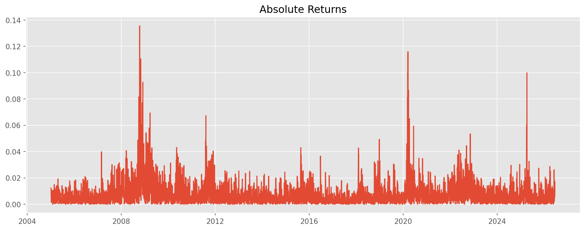 |
| 2 | Volatility Construction | Forward 20-day realised vol built as forecasting target, strong autocorrelation confirmed | 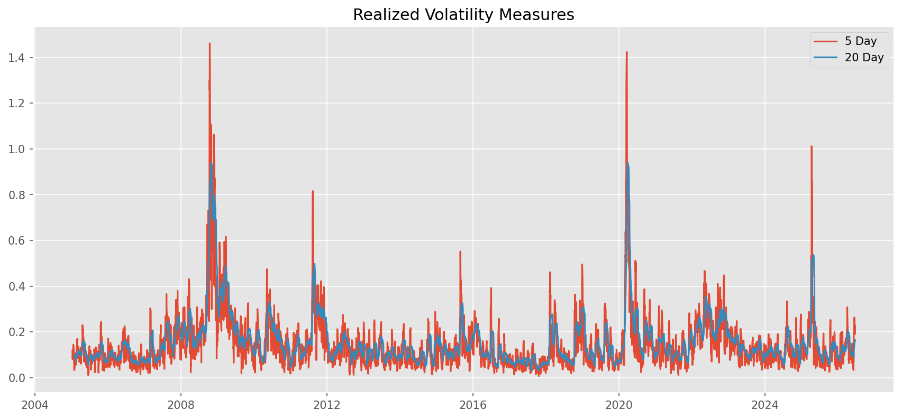 |
| 3 | Historical Volatility Forecasting | RMSE 0.1024 · MAE 0.0600, works but lags badly in crises | 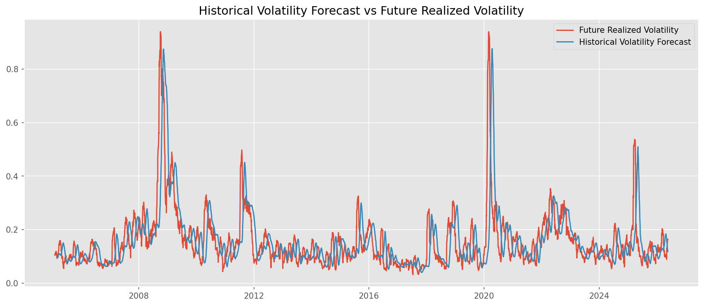 |
| 4 | EWMA (λ=0.94) | RMSE 0.0882 · MAE 0.0530, clear improvement from HVF | 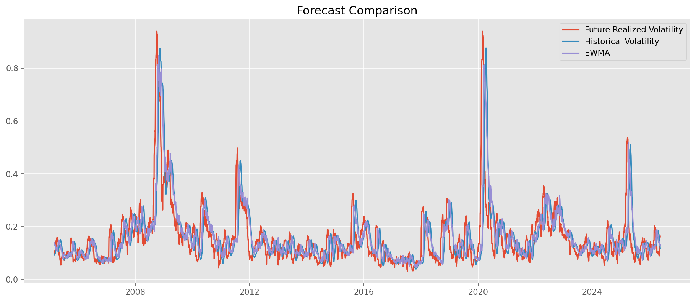 |
| 5 | GARCH(1,1) | RMSE 0.0841 · MAE 0.0521 · α+β=0.97, best model | 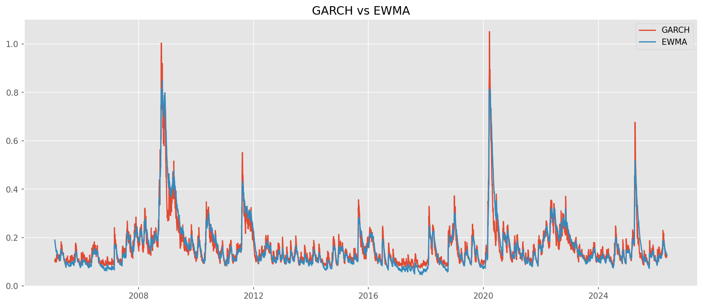 |
| 6 | Hidden Markov Models | 2 and 3 state HMM recovers 2008, COVID and 2022 without being told | 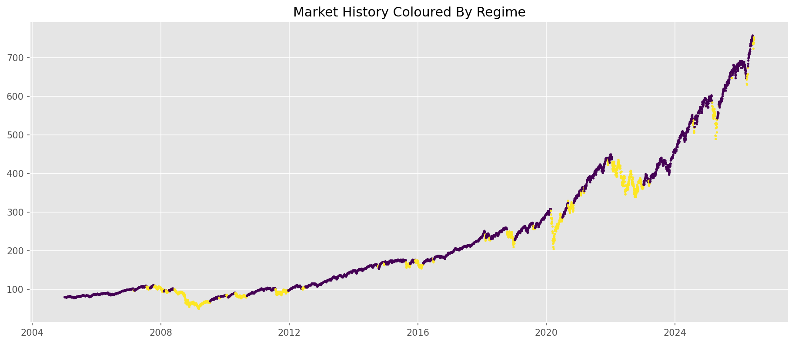 |
| 7 | Rolling OOS  | Rankings: GARCH > EWMA > HV preserved out of sample, in-sample was overfitting | 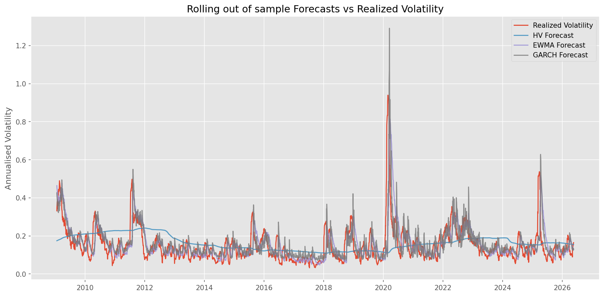 |
| 8 | Regime Aware GARCH | RMSE 0.0803 · MAE 0.0493 · MAPE 32.1%, wins during moderate stress, not unprecedented situations | 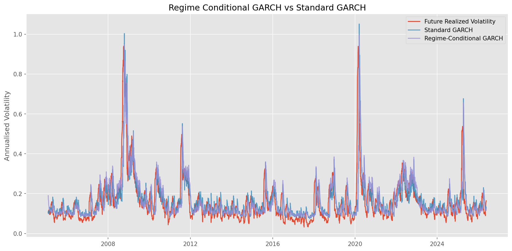 |
| 9 | Diebold-Mariano Tests | Improvements statistically significant except for GARCH | 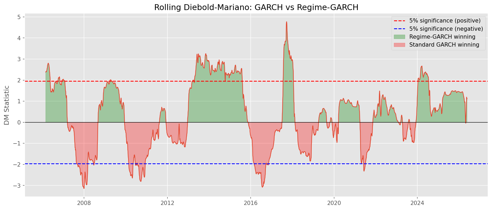 |
| 10 | Implied vs Realized | VIX bias +0.0354, P(VRP>0) = 83%, Volatility Risk Premium confirmed and measured | 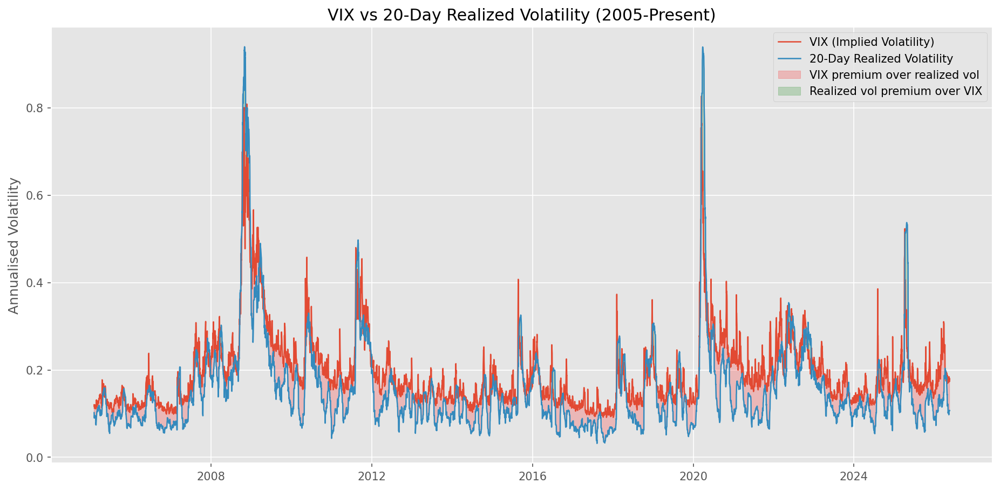 |
---

## Notebooks

### 1. Exploratory Data Analysis

**Aim:** Understand the empirical properties of SPY returns before building any models.

**Theory:** Log returns $r_t = \ln(P_t / P_{t-1})$ are approximately stationary. Their distribution, autocorrelation structure and volatility dynamics tell us what kind of model we need. To understand these things I did the following

- Plotted 20 years of price history and identified major economic events
- Computed the full return distribution and compared against Gaussian
- Measured autocorrelation of returns and squared returns
- Visualised volatility clustering and realised volatility through time

**Results:**

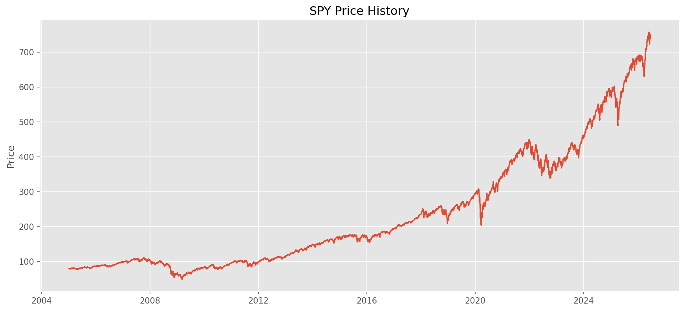

The price chart immediately shows why a constant volatility model is inadequate. The 2008 and 2020 drops are visible as abrupt falls separated by long calm periods. This is not what a single stationary process looks like. So volatility does need more attention


The clustering is the main motivation for the whole project. Large moves arrive together. Calm periods persist. The ACF of squared returns remains significantly positive across 20+ lags. So we understand volatility is forecastable because it has memory.

**Comment:** Returns themselves have near zero autocorrelation but squared returns are strongly autocorrelated. Essentially we are not predicting direction, we are predicting the size of future moves.

---

### 2. Volatility Construction and Forecasting Targets

**Aim:** Build explicit realised volatility measures and define what future models will try to predict.

**Theory:** Volatility is latent, i.e., it cannot be directly observed. The standard estimator is:

$$RV_t = \sqrt{252 \times \text{Var}(r_{t-W:t})}$$

Forward looking targets are constructed by shifting realised vol $h$ days ahead, creating $RV_{t+h}$ as the quantity to forecast using information available at time $t$. So I

- Constructed 5, 10, 20 and 60 day rolling realised volatility
- Built forward looking 20-day targets by shifting the series
- Engineered absolute returns, squared returns and rolling moving averages
- Showed correlation between current and future vol to confirm forecastability

**Results:**


Short horizon volatility reacts fast to shocks but is noisy. Long horizon vol is smoother but slower. The 20 day window is a reasonable length and the most commonly studied, so I used it as the primary target throughout.

**Comment:** A strong positive correlation between today's realised volatility and future realised volatility is the first evidence that forecasting is possible. If volatility were random, this correlation would be zero.

---

### 3. Historical Volatility Forecasting

**Aim:** To establish the simplest benchmark. Here we use the mean of recent historical volatility as the forecast.

**Theory:** If volatility is persistent, the rolling average is a reasonable starting point. It requires no parameter estimation but still makes so sense. So we

- Implemented rolling window HV forecasts at multiple horizons
- Evaluated against realised volatility targets visually and with RMSE and MAE
- Studied performance specifically during the 2008 and 2020 crises
- Compared different window lengths to understand the responsiveness tradeoff

**Results:**


| Metric | Value |
|---|---|
| RMSE | 0.1024 |
| MAE | 0.0600 |

The model tracks broad volatility trends reasonably well but lags badly when volatility changes quickly. During the COVID crash, HVF still forecasted low volatility for weeks after markets had already started falling sharply.

**Comment:** The lag is a structural feature of any averaging model. Short windows react faster but introduce noise, long windows are stable but even slower. So nothing can really fix this. This motivated me to move towards something diffferent than just a simple average.

---

### 4. RiskMetrics EWMA

**Aim:** We want to replace equal weightage with exponential weightage. Intuitively this makes sense because recent observations matter more.

**Theory:** The EWMA variance recursion is:

$$\sigma^2_t = \lambda \sigma^2_{t-1} + (1-\lambda) r^2_{t-1}$$

The decay parameter $\lambda$ controls the memory of the model. The RiskMetrics standard is $\lambda = 0.94$, is calibrated to balance responsiveness and stability. To incorporate this, we 

- Implemented the EWMA recursion from scratch
- Compared against HV benchmark visually and with metrics
- Explored sensitivity to $\lambda$ across the range 0.85 to 0.99
- Studied the performance of EWMA during the COVID crash

**Results:**


| Metric | HV | EWMA |
|---|---|---|
| RMSE | 0.1024 | 0.0882 |
| MAE | 0.0600 | 0.0530 |

EWMA reacts noticeably faster. The improvement is most visible during transitions when the market moves from calm to stressed, EWMA picks it up within days rather than weeks like HVF.

**Comment:** The improvement is real but EWMA still does not learn from data. The $\lambda = 0.94$ value is fixed by convention (ofcourse through years of testing and research). There is no mechanism for the model to learn the difference betweent two different crisis. So we need a model which learns from the data. 

---

### 5. GARCH(1,1)

**Aim:** Let the data determine volatility dynamics rather than imposing a fixed decay parameter.

**Theory:** GARCH(1,1) models conditional variance as:

$$\sigma^2_t = \omega + \alpha r^2_{t-1} + \beta \sigma^2_{t-1}$$

Parameters are estimated by maximum likelihood. $\alpha$ captures the reaction to new shocks, $\beta$ captures persistence and $\omega$ sets the long run variance level. Persistence is measured by $\alpha + \beta$. In this notebook I

- Estimated GARCH(1,1) via MLE using the arch library
- Interpreted the estimated parameters and their economic meaning
- Compared conditional volatility estimates against EWMA
- Evaluated forecast accuracy and studied the COVID period
- Ran rolling parameter estimation to check whether parameters are stable

**Results:**


| Parameter | Estimate |
|---|---|
| $\omega$ | 0.0227 |
| $\alpha$ | 0.0876 |
| $\beta$ | 0.8981 |
| $\alpha + \beta$ | 0.9857 |

| Metric | EWMA | GARCH |
|---|---|---|
| RMSE | 0.0882 | 0.0841 |
| MAE | 0.0530 | 0.0521 |

The persistence of 0.97 confirms that volatility shocks decay very slowly, i.e., a spike takes months to fully dissipate. The rolling parameter estimation showed that $\alpha$ and $\beta$ are not constant through time, which is a clue that a single regime model might be missing something.

**Comment:** GARCH is genuinely better than EWMA not because of a coincidence in this dataset but because it learned the persistence from data rather than assuming it. The improvement is smaller than the step from HV to EWMA but GARCH can be extended to accommodate different dynamics in different market environments. However as said earlier, a single regime model might be missing something, hence we try to look at HMMs. 

---

### 6. Hidden Markov Models and Regime Detection

**Aim:** To determine whether financial markets operate in distinct hidden volatility regimes.

**Theory:** A Gaussian HMM assumes the observed return series is generated by a latent Markov chain switching between $K$ hidden states. Each state has its own mean and variance. 

The transition matrix $\mathbf{A}$ where $A_{ij} = P(\text{state}_{t+1} = j \mid \text{state}_t = i)$ characterises how the market moves between states. The expected duration of each regime is $\frac{1}{1 - A_{ii}}$. In this notebook we

- Fitted 2 state HMM on SPY daily returns from 2005 to present
- Characterised each state by return mean, standard deviation and minmax
- Coloured 20 years of price history by regime assignment
- Extended to 3 state HMM to check for an intermediate regime
- Computed and visualised the transition matrix
- Plotted the regime sequence through time

**Results:**


This graph shows the market history coloured by regime. The 2008 crisis sits cleanly in one state, the long bull run from 2012 to 2020 in another and COVID shows an abrupt transition and fast return. The model was given nothing but raw daily returns, no dates, no macro variables, no crisis labels, so it has classified everything on its own.

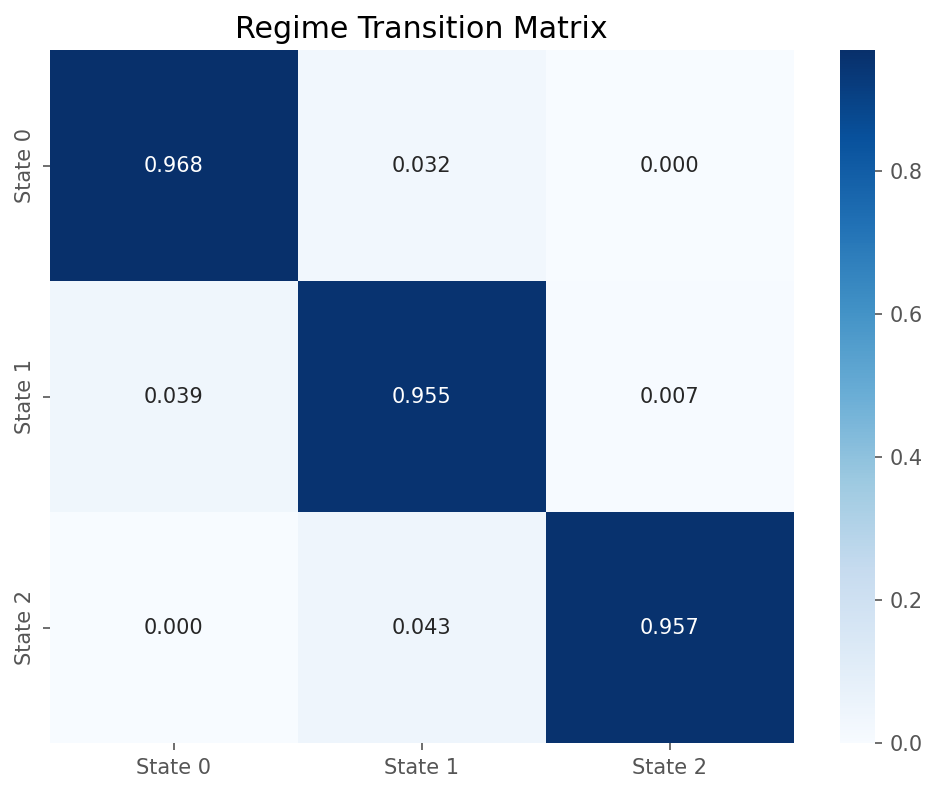

| | State 0 | State 1 |
|---|---|---|
| **State 0** | 0.976 | 0.024 |
| **State 1** | 0.053 | 0.947 |

The high diagonal entries confirm that regimes are persistent. A persistence of 0.97 implies an average regime duration of around 33 trading days. Once the market enters a stress state, it tends to stay there for 5 weeks or so.

**Comment:** What I find most striking about this result is that the HMM never saw a calendar. It discovered that 2008 was different from 2014 purely from the statistical fingerprint of the return series. The transition matrix also gives us a way to explain volatility clustering structurally. It is not just a feature of the data, it is a consequence of persistent latent states.

---

### 7. Rolling Out of Sample Evaluation

**Aim:** So far we risked overfitting to understand how our 3 forecasting models work. Now it is time to evaluate all of them honestly.

**Theory:** In sample evaluation fits the model to all data and measures error on the same data. However, a proper evaluation trains only on data available before each forecast date. With a rolling window of 1000 observations, the model is refit at each step and one step ahead forecasts are recorded.

The QLIKE loss function, derived from the Gaussian quasi-likelihood, is included alongside RMSE and MAE. It penalises underestimation of risk more heavily than overestimation, which is the most important aspect for us.

$$\text{QLIKE} = \mathbb{E}\left[\log(\hat{\sigma}^2) + \frac{\sigma^2}{\hat{\sigma}^2}\right]$$

To do this we

- Implemented rolling out of sample framework for HV, EWMA and GARCH
- Computed RMSE, MAE, MAPE and QLIKE across the full test period
- Isolated performance during the 2008 crisis and COVID
- Partitioned the test period by volatility level (low, medium, high) and compared models within each regime

**Results:**


| Model | RMSE | MAE | QLIKE |
|---|---|---|---|
| Historical Volatility | 0.1024 | 0.0600 | -2.248 |
| EWMA | 0.0882 | 0.0530 | -2.506 |
| GARCH | 0.0841 | 0.0521 | -2.563 |

All three metrics consistently claim GARCH > EWMA > HV. The QLIKE ordering also agrees. More negative means stronger penalty for underestimation. 

**Comment:** In sample RMSE for EWMA and GARCH was slightly better than out of sample. This confirms that they were overfitting somewhat. But the ranking survives the correction. Interestingly during medium volatility periods, HV outperforms the others. This makes me believe model combinations might do better than any single model. 

---

### 8. Regime Aware GARCH

**Aim:** Now I wanted to combine the HMM regime assignments from notebook 6 with GARCH to build a model that uses different parameters in different situations. 

**Theory:** Standard GARCH assumes constant parameters $(\omega, \alpha, \beta)$ across the full sample. But the rolling parameter estimation in notebook 5 showed these are not stable. So we want to estimate separate GARCH parameters on the low and high volatility regime subsets, then run a single forward recursion through the full time series, switching parameter sets at each day according to the HMM state assignment. 

$$\sigma^2_t = \omega_{s_t} + \alpha_{s_t} r^2_{t-1} + \beta_{s_t} \sigma^2_{t-1}$$

where $s_t \in \{0, 1\}$ is the HMM state at time $t$.

So I:

- Fitted 2 state HMM and separated returns by regime
- Estimated GARCH parameters on each regime subset
- Built the corrected single recursion regime conditional GARCH
- Compared against standard GARCH on forecast accuracy
- Used HMM state probabilities as aa volatility signal
- COVID case study

**Results:**


| Model | RMSE | MAE | MAPE |
|---|---|---|---|
| Historical Volatility | 0.1024 | 0.0600 | 39.05% |
| EWMA | 0.0882 | 0.0530 | 35.40% |
| GARCH(1,1) | 0.0841 | 0.0521 | 36.26% |
| Regime-Conditional GARCH | 0.0803 | 0.0493 | 32.13% |

The regime conditional model achieves the best result across all metrics. Regime GARCH also produces the smallest MAPE meaning its proportional errors are the smallest.

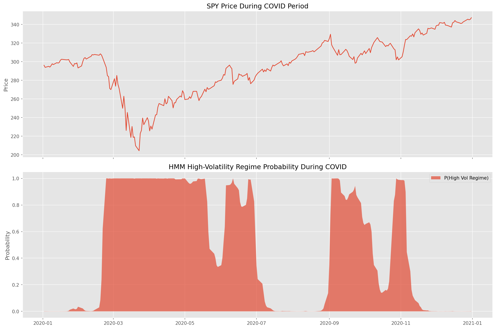

**The COVID case study:** the HMM probability of being in the high volatility regime jumped sharply in late February 2020, before the worst crash. This is good warning signal generated purely from return dynamics.

**Comment:** One thing I had to fix during this notebook was a subtle bug. My original approach fitted GARCH on non-contiguous rows belonging to each regime and wrote the conditional volatility values back into the full series. This broke the temporal chain, GARCH at day 3 was using the variance from day 1 as its prior, completely ignoring day 2. The single forward recursion approach fixed this and produced noticeably better results.

---

### 9. Diebold-Mariano Tests and Statistical Comparison

**Aim:** To determine whether the RMSE improvements observed across notebooks are statistically significant or just noise

**Theory:** The Diebold-Mariano test treats the sequence of loss differentials between two models as a time series:

$$d_t = L(e^1_t) - L(e^2_t)$$

and tests whether $\mathbb{E}[d_t] = 0$ using the statistic

$$DM = \frac{\bar{d}}{\sqrt{\hat{\sigma}^2_d / T}}$$

where $\hat{\sigma}^2_d$ is a Newey-West HAC variance estimate that accounts for autocorrelation in the error series. Under the null of equal accuracy, DM is asymptotically standard normal. To test, I

- Implemented the DM test from scratch with HAC correction
- Ran all pairwise model comparisons and built the full DM matrix
- Visualised the matrix as a heatmap
- Computed rolling DM statistics (250 day window) to see when regime GARCH wins and loses

**Results:**

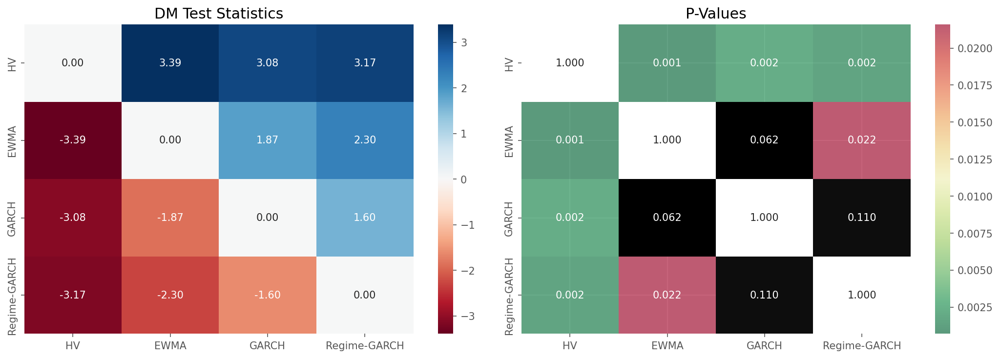

Every model significantly outperforms HV. Regime GARCH significantly outperforms EWMA and HV. The GARCH vs Regime GARCH comparison is a little for nuaced because p value is not significant but that is because we are on a rolling window, so no one is significantly better.


In rolling DM chart Regime GARCH wins during the 2013–2019 period where markets cycled through moderate stress episodes. Because this is exactly the environment regime detection is designed for. Standard GARCH does better during the heart of the 2008 financial crisis and again briefly around 2020 COVID. Because both of these were unprecedented event, so the HMM had no historical precedent for them in training, so its regime assignments became unreliable exactly when they needed to be most accurate. Standard GARCH, with no regime overhead to miscalculate actually handled the raw shock more cleanly in those windows.

So regime GARCH earns its added complexity during normal to moderate stress, which makes up the majority of the sample. It underperforms during once in a decade structural breaks that fall outside what the HMM has ever seen, which is also when no model performs particularly well.

| Model | RMSE | MAE | MAPE (%) | QLIKE | Hit Ratio | Bias |
|---|---|---|---|---|---|---|
| Historical Volatility | 0.10235 |	0.05998	| 39.05	| -2.3351 | 0.464 | -0.00008 |
| EWMA | 0.08819 |	0.05305	| 35.40	| -2.5338 | 0.320	| 0.00351 |
| GARCH(1,1) | 0.08412 |	0.05206	| 36.26	| -2.6070 |	0.506 |	0.00454 |
| Regime-Conditional GARCH | 0.08236 | 0.05135	| 34.91| -2.6155 | 0.503|	0.00555|


---

### 10. Implied vs Realized Volatility and the Volatility Risk Premium

**Aim:** To connect the forecasting work to the options market by studying VIX against realised volatility and measuring the Volatility Risk Premium.

**Theory:** The Volatility Risk Premium is defined as:

$$VRP_t = IV_t - RV_{t, t+20}$$

where $IV_t$ is VIX at time $t$ and $RV_{t,t+20}$ is realised volatility over the following 20 trading days. If investors were risk-neutral, VRP would be zero on average. The fact that it is persistently positive reflects the premium investors pay for downside protection.
To study this I

- Aligned VIX and SPY realised volatility on a common index
- Visualised VIX vs realised vol across 20 years with shaded premium areas
- Computed VRP statistics: mean, std, skewness, frequency positive
- Plotted the distribution of VRP and its evolution through time
- Evaluated VIX as a volatility forecast and compared against our models
- Measured VRP by volatility regime
- Tested whether the current VRP level predicts future equity returns

**Results:**


Red shaded areas show VIX above realised volatility. Here investors overpaid for protection in hindsight. Green shows the rare periods where realised vol exceeded VIX, i.e., the market underpriced the actual crisis.

| Statistic | Value |
|---|---|
| Mean VRP | +0.035 |
| Std VRP | 0.058 |
| Skewness | negative |
| P(VRP > 0) | 83% |

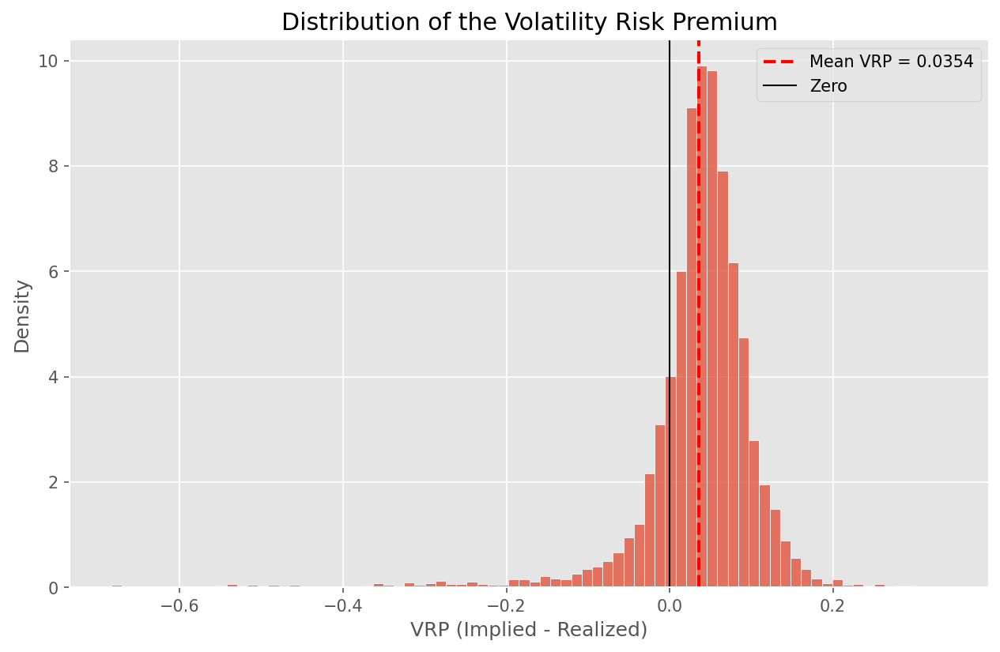

The distribution has a positive centre of mass and a long left tail. The extreme left observations are events like 2008 and COVID,  the moments when realised vol exploded past anything VIX had priced.

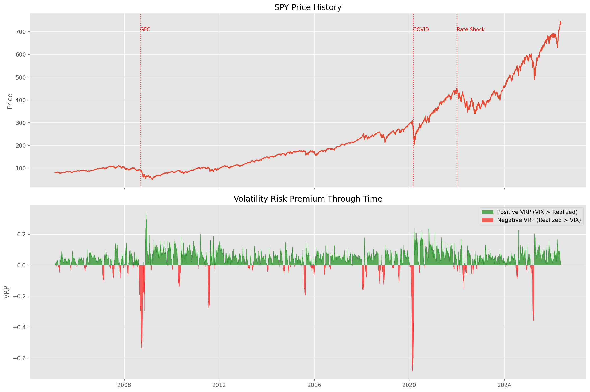

VIX as a forecast: RMSE 0.0856, MAE 0.0612, Bias +0.0354. This compares to GARCH at RMSE 0.0841 and Regime GARCH at 0.0803. VIX is competitive despite no parameter fitting to the data. The reason GARCH beats it on RMSE is that GARCH is numerically optimised in sample against exactly that metric. VIX is not trying to minimise RMSE, it is actually pricing insurance and it intentionally includes the risk premium on top of expected realised vol.

The VRP by volatility regime produced a nuanced result. The mean VRP was highest in the medium volatility regime rather than the low volatility regime as expected. The high volatility regime still showed a positive mean VRP of 0.0385. This is because the bins are defined by current realised volatility, not future. When current vol is already elevated, it often mean-reverts downward over the next 20 days. VIX stays high so it continues to overestimate. The negative VRP observations come from transition days, when current vol is still calm but the next 20 days are crashing. Those days sit in the medium volatility bin, which is why the high volatility mean stays positive despite containing the worst crisis episodes.

**Comment:** Options are on average overpriced relative to future realised volatility, which is why selling volatility is a profitable strategy. But the fat left tails coming from things like the 2008 and COVID episodes is exactly the risk we are bearing when we do it. This assymetry comes from the need to downside protection. 

---

## Key Takeaways

**Volatility is forecastable.** The ACF of squared returns in notebook 1 was the first hint. By notebook 9, four models had been formally evaluated out of sample and all of them beat the naive historical average with statistically significant margins. The uncertainty is not whether volatility can be forecast, but by how much and under what conditions.

**Each modelling choice earned its complexity.** EWMA improved on HV because recency matters. GARCH improved on EWMA because learning dynamics from data beats fixing a decay parameter by convention. Regime GARCH improved on standard GARCH because volatility in a crisis is genuinely different from volatility in a bull market and the model should reflect that.

**Hidden regimes are real.** The HMM found low and high volatility states that align precisely with 2008, COVID and 2022 without being told anything about those events. The transition matrix confirmed that these states are persistent. That once the market enters a stress regime it typically stays there for over a month on average.

**No model dominates in all conditions.** The rolling Diebold-Mariano chart shows that  regime GARCH wins most of the time and wins during moderate stress cycles. But standard GARCH wins during genuine crisis s where the HMM has no historical precedent. 

**VIX overestimates but is not wrong.** The mean Volatility Risk Premium is +3.5% and positive 83% of the time. This is interpretedd as the premium investors demand for bearing tail risk. The left skewness of the VRP distribution tells us that selling volatility pays most of the time, until it really does not.

**The things that connected across notebooks.** The fat tails in notebook 1 are partially explained by regime mixing in notebook 6. The volatility clustering in the ACF is given a structural explanation in the transition matrix. The instability of GARCH parameters in notebook 5 motivates the regime switching approach in notebook 8. So it is all connected

---

## Data

- **SPY daily prices** from Yahoo Finance, January 2005 to present
- **^VIX daily levels** from Yahoo Finance, same period
- approx 5,000 trading day observations across two full decades

## Dependencies

```
yfinance
arch
hmmlearn
scikit-learn
scipy
pandas
numpy
matplotlib
seaborn
```
